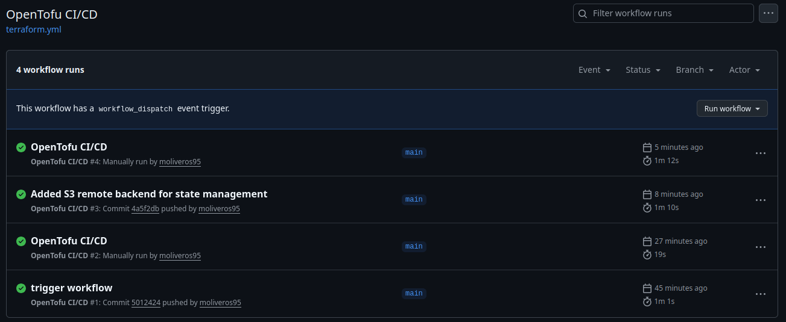

# AWS Infrastructure with OpenTofu + GitHub Actions CI/CD

## Overview
This project provisions AWS infrastructure using OpenTofu (IaC) and automates 
deployment through a GitHub Actions CI/CD pipeline. Every push to the `main` 
branch automatically triggers an OpenTofu plan and apply. Destroy can be 
triggered manually via workflow dispatch.

## Architecture
- **VPC** – Isolated network with a public subnet
- **EC2** – t3.micro instance (Amazon Linux 2)
- **S3** – Private bucket with public access blocked
- **Internet Gateway + Route Table** – Public internet access for the subnet
- **Security Group** – SSH access on port 22
- **S3 Remote Backend** – OpenTofu state stored in S3 for pipeline and local sync

## Tools & Technologies
- [OpenTofu](https://opentofu.org/) – Infrastructure as Code
- [AWS](https://aws.amazon.com/) – Cloud provider (ap-southeast-1)
- [GitHub Actions](https://github.com/features/actions) – CI/CD pipeline

## Project Structure
```
aws-terraform-pipeline/
├── .github/
│   └── workflows/
│       └── terraform.yml
├── main.tf
├── variables.tf
├── outputs.tf
├── providers.tf
└── .gitignore
```

## Prerequisites
- AWS account with CLI configured
- OpenTofu installed
- S3 bucket for remote state
- GitHub repository secrets set:
  - `AWS_ACCESS_KEY_ID`
  - `AWS_SECRET_ACCESS_KEY`

## Usage

### Deploy manually
```bash
tofu init
tofu plan
tofu apply
```

### Destroy infrastructure
```bash
tofu destroy
```

### CI/CD
- **Apply** – Push to `main` branch, pipeline runs automatically
- **Destroy** – Go to Actions → OpenTofu CI/CD → Run workflow → select `destroy`

## Remote State
State is stored remotely in S3 bucket ensuring consistent 
state between local and pipeline executions.

## Pipeline
